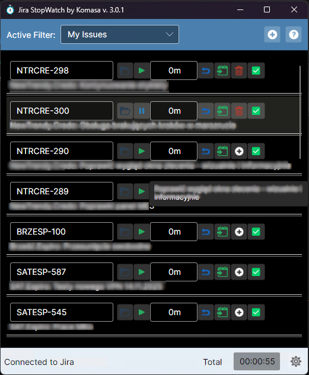
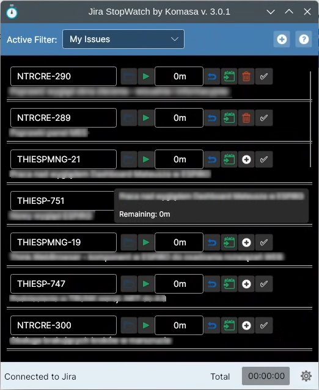
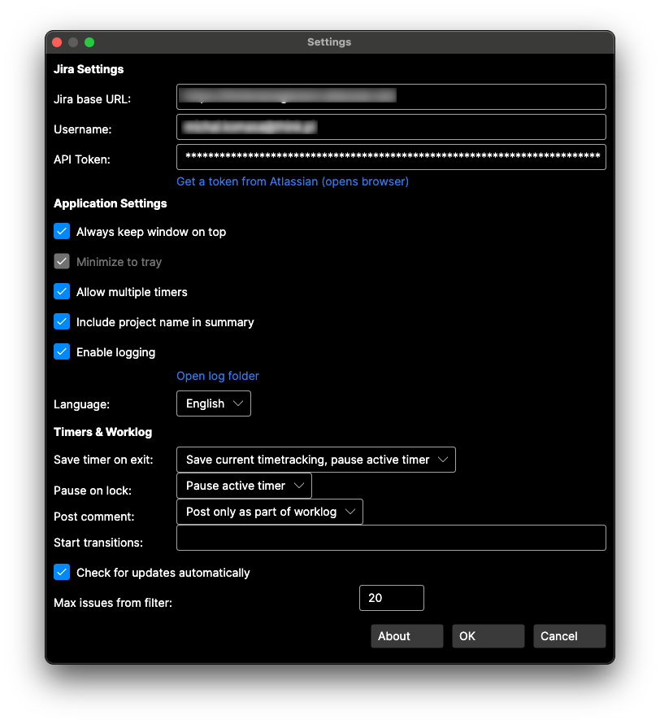

## Jira StopWatch by Komasa (v3.0)

Language • Język: [English](#english) | [Polski](#polski)

Binary files (Windows, MacOS, Linux): https://github.com/bigkoma/jirastopwatch/tree/master/dist

By me coffee: https://buymeacoffee.com/komasa

---
### Screenshots

  

    
Windows

    
  

  

    
macOS

    
  

  

    
Linux

    
  

  
Settings

  

---

## English

This is a new branch and approach to the classic “Jira StopWatch”. Starting with version 3.0 the project is developed as “Jira StopWatch by Komasa” and is not backward compatible with the legacy releases we originated from.

Author of the new approach: Michał Komasa.

### Project origins

The project originates from the open‑source “Jira StopWatch” by Carsten Gehling (Apache 2.0). Many thanks to the community for years of contributions. From v3.0 we introduce significant architectural and technology changes; configuration, settings files and application behavior may differ from the legacy project and are not compatible with it.

### Status and compatibility

- Version: 3.0 (first release of the new line)
- License: Apache 2.0 – see LICENSE.txt
- Platforms: macOS, Linux, Windows (x64 and ARM, as supported by .NET and the OS)

### Technologies

- .NET (TargetFramework: net10.0)
- Avalonia UI 11 – cross‑platform desktop UI
- RestSharp – Jira REST API communication
- NUnit + Moq – unit testing

### Prerequisites

- .NET SDK 10.0 or newer installed (check: `dotnet --info`)
- On Linux you may need system packages for Avalonia (e.g., fontconfig, GTK3)

### Quick start (from source)

From the repository root:

1) Restore and build:
   - dotnet build StopWatch.sln
2) Run the app:
   - dotnet run --project source/StopWatch/StopWatch.csproj

### Building platform packages

The following examples produce Release builds. Add --self-contained true to bundle the .NET runtime (larger output, runs without .NET installed).

- Windows (x64):
  - dotnet publish source/StopWatch/StopWatch.csproj -c Release -r win-x64 -p:PublishSingleFile=true

- macOS (Intel and Apple Silicon):
  - Intel: dotnet publish source/StopWatch/StopWatch.csproj -c Release -r osx-x64 -p:PublishSingleFile=true
  - Apple Silicon: dotnet publish source/StopWatch/StopWatch.csproj -c Release -r osx-arm64 -p:PublishSingleFile=true
  - Note: the publish folder contains a .app bundle; on first run you may need to bypass Gatekeeper (right‑click → Open).

- Linux (x64/ARM64):
  - x64: dotnet publish source/StopWatch/StopWatch.csproj -c Release -r linux-x64 -p:PublishSingleFile=true
  - ARM64: dotnet publish source/StopWatch/StopWatch.csproj -c Release -r linux-arm64 -p:PublishSingleFile=true
  - Note: you may need packages like fontconfig, libgtk-3 to run the app.

Artifacts location: source/StopWatch/bin/Release/{tfm}/{rid}/publish

### Tests

- Run tests: dotnet test StopWatch.sln

### Renaming and incompatibility

- New name: “Jira StopWatch by Komasa”
- New line starts at version 3.0
- From this version, settings format, behavior and UI may differ from the legacy project and are not guaranteed to be compatible.

### Acknowledgements

Thanks to Carsten Gehling and the community of the original “Jira StopWatch” the project historically builds upon. The project remains open‑source (Apache 2.0).

---
Pliki binarne (Windows, MacOS, Linux): https://github.com/bigkoma/jirastopwatch/tree/master/dist

Postaw mi kawę: https://buymeacoffee.com/komasa

## Polski

Nowa gałąź i nowe podejście do klasycznego narzędzia „Jira StopWatch”. Od wersji 3.0 projekt jest rozwijany jako „Jira StopWatch by Komasa” i nie jest kompatybilny wstecz z poprzednimi wydaniami, od których startowaliśmy.

Autor nowego podejścia: Michał Komasa.

### Pochodzenie projektu

Projekt wywodzi się z otwarto‑źródłowego „Jira StopWatch” autorstwa Carstena Gehlinga (Apache 2.0). Dziękujemy społeczności za wieloletni wkład. Od wersji 3.0 wprowadzamy istotne zmiany architektury i technologii, dlatego konfiguracje, pliki ustawień oraz zachowanie aplikacji mogą różnić się od historycznego projektu i nie są z nim kompatybilne.

### Status i zgodność

- Wersja: 3.0 (pierwsze wydanie nowej linii)
- Licencja: Apache 2.0 – zobacz LICENSE.txt
- Platformy: macOS, Linux, Windows (x64 i ARM, jeśli wspierane przez .NET i system)

### Technologie

- .NET (TargetFramework: net10.0)
- Avalonia UI 11 – wieloplatformowy interfejs graficzny
- RestSharp – komunikacja z Jira REST API
- NUnit + Moq – testy jednostkowe

### Wymagania wstępne

- Zainstalowany .NET SDK 10.0 lub nowszy (sprawdź: `dotnet --info`)
- Na Linuksie wymagane mogą być systemowe biblioteki dla Avalonii (np. fontconfig, GTK3)

### Szybki start (uruchomienie z kodu źródłowego)

W katalogu głównym repozytorium:

1. Przywróć i zbuduj:
   - dotnet build StopWatch.sln
2. Uruchom aplikację:
   - dotnet run --project source/StopWatch/StopWatch.csproj

### Budowanie pakietów na platformy

Poniższe przykłady tworzą wydania Release. Dodaj opcję --self-contained true, aby dołączyć runtime .NET (większy pakiet, działa bez instalacji .NET).

- Windows (x64):
  - dotnet publish source/StopWatch/StopWatch.csproj -c Release -r win-x64 -p:PublishSingleFile=true

- macOS (Intel i Apple Silicon):
  - Intel: dotnet publish source/StopWatch/StopWatch.csproj -c Release -r osx-x64 -p:PublishSingleFile=true
  - Apple Silicon: dotnet publish source/StopWatch/StopWatch.csproj -c Release -r osx-arm64 -p:PublishSingleFile=true
  - Uwaga: w folderze publish powstaje struktura .app; pierwszy start może wymagać obejścia Gatekeepera (klik PPM → Otwórz).

- Linux (x64/ARM64):
  - x64: dotnet publish source/StopWatch/StopWatch.csproj -c Release -r linux-x64 -p:PublishSingleFile=true
  - ARM64: dotnet publish source/StopWatch/StopWatch.csproj -c Release -r linux-arm64 -p:PublishSingleFile=true
  - Uwaga: do uruchomienia mogą być potrzebne pakiety: fontconfig, libgtk-3.

Artefakty znajdziesz w: source/StopWatch/bin/Release/{tfm}/{rid}/publish

### Testy

- Uruchom testy: dotnet test StopWatch.sln

### Zmiana nazwy i niekompatybilność

- Nowa nazwa: „Jira StopWatch by Komasa”
- Start linii: wersja 3.0
- Od tej wersji format ustawień, zachowanie i interfejs mogą odbiegać od projektu źródłowego i nie gwarantujemy kompatybilności.

### Podziękowania

Podziękowania dla Carstena Gehlinga oraz społeczności projektu „Jira StopWatch”, na którym bazowaliśmy historycznie. Projekt pozostaje open‑source (Apache 2.0).

